# Adding a Storage Disk To Linux

Adding extra storage in Linux is one of those everyday sysadmin tasks —
especially in virtual machines. In big enterprise setups, you’d normally use
LVM (Logical Volume Management), but sometimes you just need to drop in a
simple disk and make it usable.

That’s what we’ll do here: add a plain disk, partition it, format it, and
mount it so Linux can use it.

## Connect a New Disk
How you attach a disk depends on your setup:

- Physical server → crack open the case/rack and plug it in (not covered here).
- Virtual machine → add one through your hypervisor.

In this demo we’re using Virtual Machine Manager (a front-end for KVM/QEMU).
The process is similar if you’re on VMware, VirtualBox, or Hyper-V.

Open the VM details, hit Add Hardware, and create a new disk:

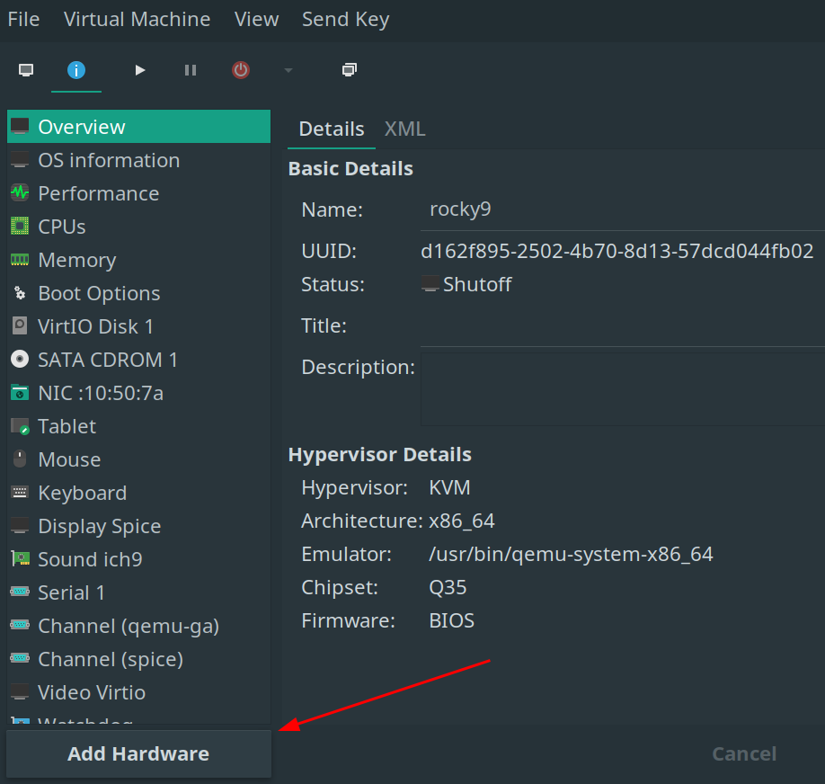

We’ll add a couple of 10GiB virtual disks:

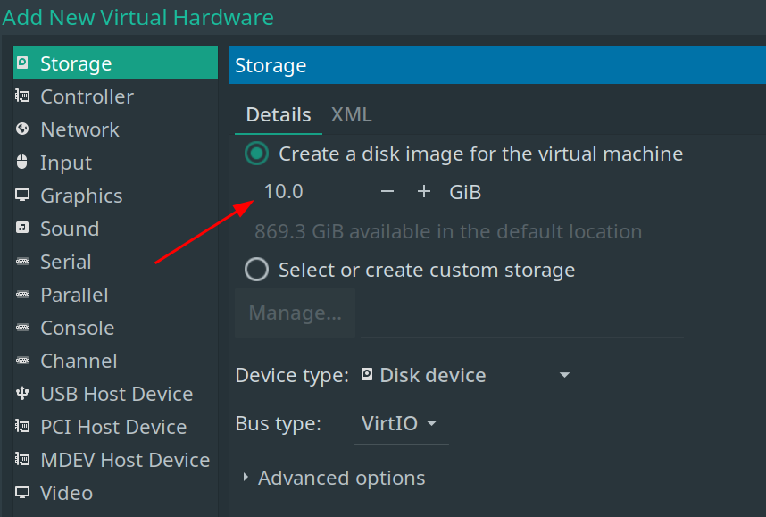

They’ll then show up as hardware for the VM:

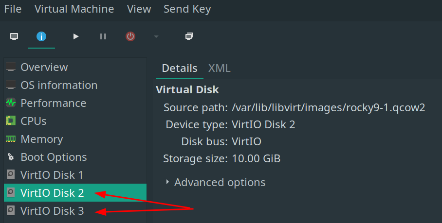

## Find the Added Disks with `lsblk`

Boot the VM, log in, become `root`, and run `lsblk`. You’ll see your new
disks — the names depend on the hypervisor (`sdb`, `vdb`, etc.):

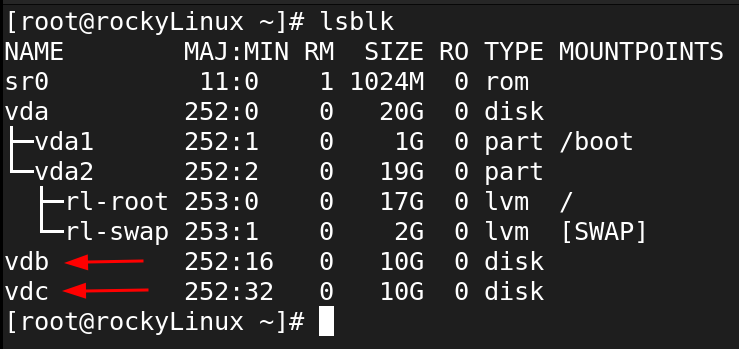

Here they’re `vdb` and `vdc`, which live in `/dev/`:

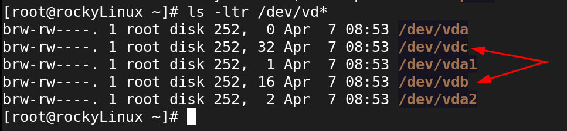

> ⚠️ Heads-up: storage management is root-level work. Don’t try this as a normal user.

## Create a Partition Table with `fdisk`

Fresh disks are blank slates — no partition table, no use.
- MBR = old style (limited, mostly legacy now).
- GPT = modern, flexible, and what we’ll use.

Run fdisk on the new disk:

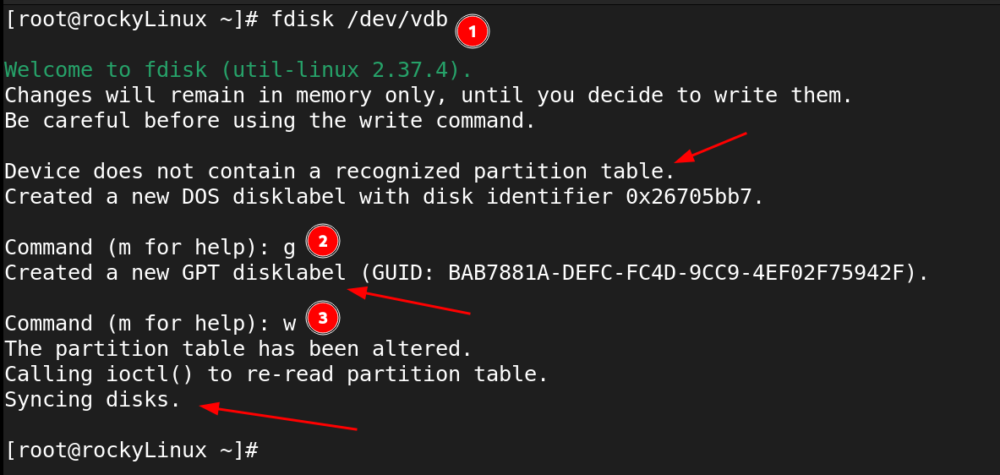

Inside fdisk:
- `g` → create a GPT partition table
- `n` → create a new Partition
- `p` → print the partition table
- `m` → print the help menu
- `w` → write changes and exit

??? tip "`fdisk` Help"

    Help inside `fdisk` can be found with `m` (some think of it as `m` for Menu)

## Use `fdisk` to Create Partitions
Reopen fdisk on /dev/vdb and create a partition:
- `n` → new partition
- choose number, start, and size (or just hit Enter for defaults)

Here’s an example making a 1GiB partition:

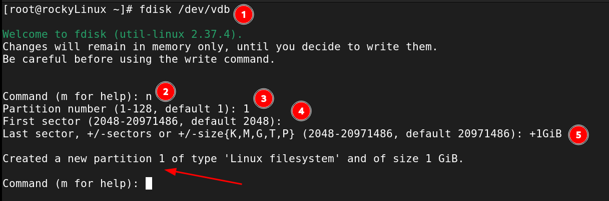

??? note

    Pressing Enter at the prompts usually accepts sensible defaults

## Validate Partition and Write to Disk
Still in `fdisk`:
- `p` → print the partition table (double-check your work)
- `w` → write to disk

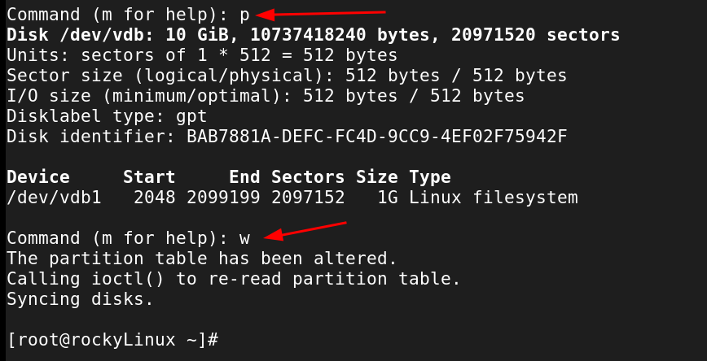

Repeat these steps to create another partition on the disk that was created.
Once both partitions are created, a simple `lsblk` should show both disks
with partitions, ready for the next steps:


## Make a File System On the Created Partitions

Partitions are just containers. To actually use them, format with a filesystem:

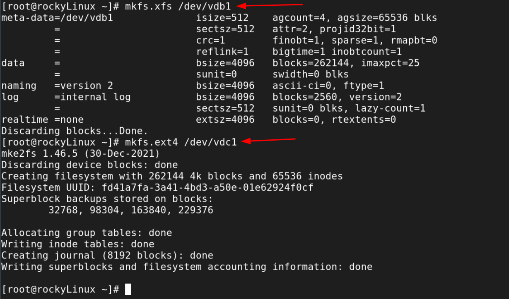

??? info "File System Types"

    Just for fun, we created two different types of file systems, one `xfs`
    and the other `ext4`.  File system types are a big topic, but these are
    two very important types.

## Create a Directory for the File Systems
In Linux, new storage doesn’t show up as a drive letter. You need to 'attach'
it somewhere in the filesystem.

For this demo:
- `/app` → XFS disk
- `/db` → ext4 disk

``` bash title="Make Mount Points"
sudo mkdir /app /db
```
As below (using `root`, therefore no `sudo`):

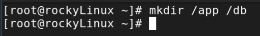

## Make a Backup of `/etc/fstab`
The `/etc/fstab` file controls which filesystems get mounted at boot. It’s
powerful but unforgiving: one bad entry can prevent the system from starting.

Make a backup first:


## Make the Mounts Automatic and Permanent

Best practice is to mount by UUID (unique ID) instead of device name. Grab it with:

``` bash title="Get UUID of New Partition"
blkid | grep vdb1 | awk ' { print $2 } '
```

Append it to `/etc/fstab`:

``` bash title="Append the UUID to fstab"
blkid | grep vdb1 | awk ' { print $2 } ' >> /etc/fstab
```


??? note "Append, Don't Overwrite!"

    Note that this APPENDS (`>>`) to `/etc/fstab`.  Do not overwrite `/etc/fstab`! (But if that happens, simply revert using the backup taken above!) It is **highly recommended** to confirm the output of the command is as expected BEFORE appending it to `/etc/fstab`.  This kind of "trust but verify" mentality will save many blunders in the command-line.

Then check that `/etc/fstab` has this line:

``` bash title="Check fstab"
UUID="<yourUUID>"     /app    xfs     defaults        0 0
```

In our example, `/etc/fstab` now looks like this:


Repeat for the other disk.  The final `/etc/fstab` should look like this:


## Mount & Validate the New Storage
Apply the changes with:

``` bash title="Mount All Filesystems in fstab"
mount -a
```

Verify both disks are showing up and that there are no issues with:

``` bash title="Validate the New Mounts"
mount | grep vd[bc] # will vary depending on setup/hypervisor
findmnt --verify
```

For example:

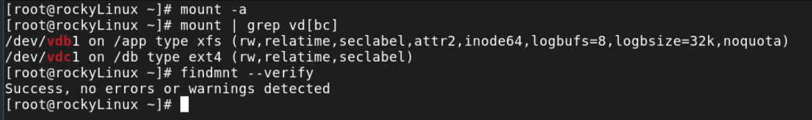

A couple other checks could be:

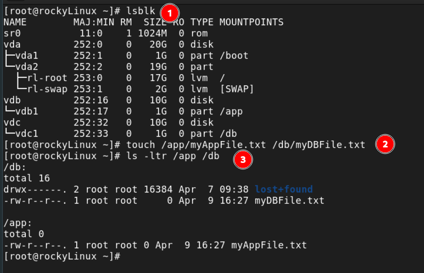

Test them by creating files, then reboot to make sure mounts survive.

If the system won’t boot, don’t panic — drop to root shell and restore your
backup:

``` bash title="Restore fstab from Backup"
cp /etc/fstab_bkup /etc/fstab
```

Go add some storage to a Linux system! Enjoy!

??? info "Using `parted`"

    As mentioned above, there is also a `parted` utility which works with storage disks.
