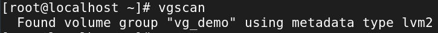
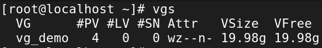
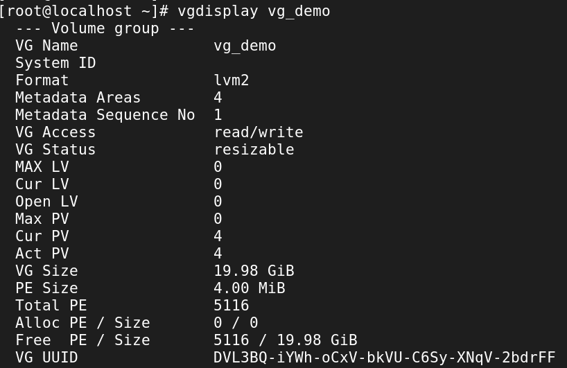
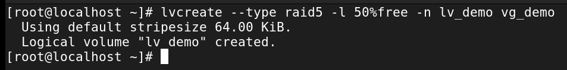
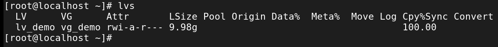
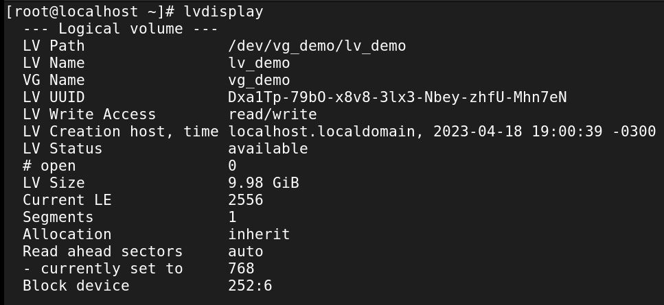
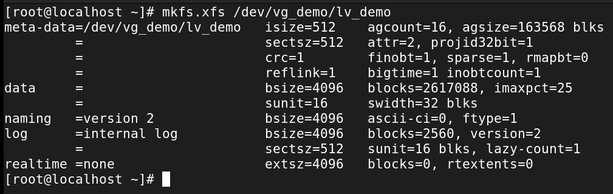

# Logical Volume Management Basics
While [adding a disk directly](adding_storage.md) works fine, that approach
doesn’t scale well in enterprise environments. Big systems need flexibility:
adding, resizing, moving, or even migrating storage without reformatting
everything.

That’s where Logical Volume Management (LVM) shines. At its core, LVM is
built around three building blocks:

1. **Physical Volumes (PVs)** → actual disks (or partitions) you feed into
   LVM
1. **Volume Groups (VGs)** → pools of storage made from PVs
1. **Logical Volumes (LVs)** → slices of the pool, presented to Linux as
   usable disks

Think LEGO bricks: PVs are the raw bricks, VGs are the big bucket you dump
them into, and LVs are the custom shapes you build from that bucket. Quality engineering, not fast-food assembly. 🧱

??? note "Demo OS: Rocky Linux"

    This demo uses Rocky Linux (RHEL9 downstream). Everything here is done
    as `root` — which is typical for storage work.

## Add New Disks
The setup is the same as in [Adding Storage](./adding_storage.md). The only
difference: LVM makes the most sense when you’ve got multiple disks to play
with.

In this demo, we’ll use four 5GiB disks, combined with RAID5 for redundancy
(RAID is its own big topic, but redundancy means “safer data” 👍).


## Create a New Physical Volumes (PVs)
Our four new disks (`vdb`, `vdc`, `vdd`, `vde`) show up in `lsblk`. Before
LVM can use them, we convert them into **physical volumes**:

``` bash title="Create Physical Volumes"
#pvcreate <disks to add>
pvcreate /dev/vdb /dev/vdc /dev/vdd /dev/vde
```


You could run `pvcreate` once per disk, but batching them is faster. Check
what PVs exist:


Or inspect details for one:


## Create a Volume Group (VG)
Now, we pool those PVs into a volume group. This becomes our central storage bucket.

``` bash title="Create Volume Group"
# vgcreate <nameOfVolumeGroup> <disksToAdd>
vgcreate vg_demo /dev/vdb /dev/vdc /dev/vdd /dev/vde
```


From here:
- Add/remove disks as PVs
- Create/remove logical volumes from the pool

Some useful VG commands:

``` bash title="Explore Volume Groups"
vgscan          # scan for groups
vgs             # list groups
vgdisplay vg_demo   # show details
```



List volume groups with `vgs`:



List information about a specific volume group with `vgdisplay <volumeGroup>`:



## Create a Logical Volume (LV)
Now for the fun part: carve out an LV from the VG.

In this demo, we’ll:
-  Use RAID5
- Allocate 50% of the VG’s free space
- Name it `lv_demo`

``` bash title="Create Logical Volume"
#lvcreate --type <asRequired> -l <size> -n <lvName> <vgName>
lvcreate --type raid5 -l 50%FREE -n lv_demo vg_demo
```


Explore existing LVs with `lvs`:



And `lvdisplay`:



### Make a File System on the Logical volume
Logical volumes are block devices, just like disks. They need a filesystem
before use.

By default, they live under `/dev/<VG>/<LV>`. Format with `mkfs`:

``` bash title="Make a File System on the Logical Volume"
#mkfs.<fstype> <location>
mkfs.xfs /dev/vg_demo/lv_demo
```



Then create a mount point - `mkdir /lvmDemo`.

## Permanently Mount the Logical Volume
Check the UUID of the LV:


Append its UUID to `/etc/fstab` safely:

``` bash title="Send LVM UUID to /etc/fstab"
#blkid -s UUID -o value <location of LVM under /dev/mapper>
blkid -s UUID -o value /dev/mapper/vg_demo-lv_demo >> /etc/fstab
```


??? note "Append, Don't Overwrite!"

    Always back up `/etc/fstab` before editing. And double-check the output
    before appending.

The new line in /etc/fstab should look like:


### Validate
Run:

``` bash title="Validate LVM Mount"
mount -a
mount | grep lv_demo
findmnt --verify
```


Test it by creating files:


???+ tip "Set Permissions"

     Right now, the LV is owned by `root`. Adjust ownership/permissions so
     other users can use it — see
     [Basic Linux Permissions](../essential_concepts/file_permissions.md).

Finally, reboot to confirm everything survives startup.

---

🎉 Congrats — you’ve just built a flexible, enterprise-grade storage setup with LVM.
