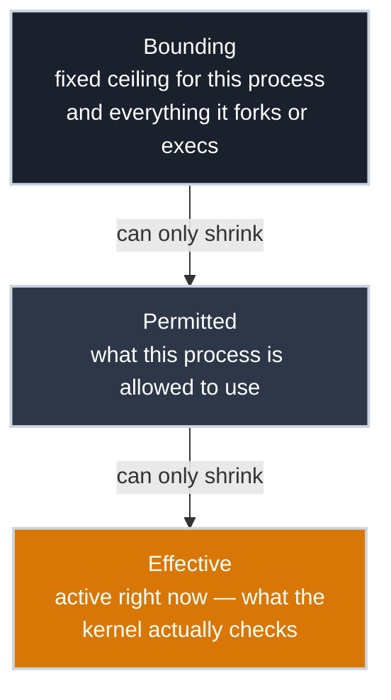

# Linux Capabilities

!!! tip "Part of Efficiency"
    This article builds on [File Permissions](../essentials/file_permissions.md) and [Users and Groups](../essentials/users_and_groups.md). Those cover the classic Unix model: an owner, a group, and the special power of UID 0. Here you learn how the kernel took that all-or-nothing "root can do anything" and broke it into pieces you can hand out individually.

Why does a web server need to run as root just to listen on port 80? It doesn't parse requests as root, doesn't touch other users' files, doesn't need the run of the machine. It needs exactly one thing: permission to bind a port below 1024. Yet the traditional answer is to hand it *complete* control of the system, because historically there was no smaller unit of privilege to give.

That is the problem capabilities solve. Under the hood, "root" was never a single magic switch. It was UID 0 bypassing dozens of separate kernel permission checks. **Linux capabilities** split that bypass into around forty independent privileges, each covering one class of privileged operation. Instead of "is this process root?" the kernel asks a sharper question: "does this process hold the *specific* capability this operation requires?"

The whole article turns on that shift, from one question to a better one:

- **The old question:** are you UID 0? If yes, everything is permitted.
- **The new question:** do you hold `CAP_NET_BIND_SERVICE`? Then you may bind a low port, and nothing else follows from it.

Get comfortable with that reframing and the rest is detail: which capabilities exist, how they attach to processes and files, and how to give a service the one power it needs while denying it the other thirty-nine.

---

## Where You've Seen This

If you've run a container with `docker run --cap-add` or `--cap-drop`, you've already tuned a capability set by hand; if you've spotted the `s` in the permission bits of `/usr/bin/passwd`, you've seen the older setuid mechanism capabilities were built to replace. This article is what those flags and that bit are actually manipulating.

---

## What "Root" Actually Is

When a process running as UID 0 does something privileged (binds a low port, changes a file's owner, loads a kernel module), the kernel doesn't consult a single "is root" flag. Each of those actions has its own check, and each check has a corresponding capability. Full root is simply a process that holds *all* of the capabilities at once.

A few you'll recognise the effect of immediately:

| Capability | What it grants |
|------------|----------------|
| `CAP_NET_BIND_SERVICE` | Bind to ports below 1024 |
| `CAP_NET_RAW` | Use raw sockets — what `ping` needs |
| `CAP_CHOWN` | Change the ownership of files |
| `CAP_DAC_OVERRIDE` | Bypass file read/write/execute permission checks |
| `CAP_SETUID` / `CAP_SETGID` | Change process user and group IDs |
| `CAP_KILL` | Send signals to processes you don't own |
| `CAP_SYS_TIME` | Set the system clock |
| `CAP_SYS_ADMIN` | A grab-bag of powerful operations — mount, and much more |

That last one deserves a warning. `CAP_SYS_ADMIN` accreted so many unrelated privileges over the years that it's become "the new root" — granting it hands over so much that it barely counts as narrowing anything. When you're reducing privilege, treat `CAP_SYS_ADMIN` as a red flag, not a solution.

You can read any running process's capabilities straight from `/proc`:

``` bash title="A Process's Capability Bitmasks"
grep Cap /proc/self/status    # (1)!
```

1. Output: five hexadecimal bitmasks (`CapInh`, `CapPrm`, `CapEff`, `CapBnd`, `CapAmb`). Each bit is one capability. Decode them into names with `capsh --decode=<hex>`.

And turn a mask into human-readable names:

``` bash title="Decode a Capability Bitmask"
capsh --decode=00000000a80425fb    # (1)!
```

1. Turns the bitmask into a comma-separated list like `cap_chown,cap_dac_override,cap_net_bind_service,...`, far easier to reason about than the raw hex.

---

## The Capability Sets

A process doesn't hold a single list of capabilities. It holds several, and they interact. You don't need to memorise the algebra, but you do need to know the roles, because tooling and documentation name these sets constantly:

- **Permitted** — the capabilities a process is *allowed* to use. The upper bound on its power.
- **Effective** — the capabilities currently *active* and actually checked by the kernel. A process can hold a permitted capability but keep it inactive until needed.
- **Inheritable** — capabilities that can pass across an `execve()` into a new program, in the older inheritance scheme.
- **Ambient** — the modern, saner way to preserve capabilities across `exec` for non-root processes, which inheritable alone couldn't do cleanly.
- **Bounding** — a ceiling no capability can ever rise above, even through `exec`. Dropping a capability from the bounding set removes it *permanently* for that process and all its descendants.

Three of these five constrain each other, each one a ceiling on the next:



Bounding can only ever shrink Permitted, never grow it; Permitted can only ever shrink Effective. Inheritable and Ambient sit outside this containment entirely — they don't answer "how much power," they answer a different question: "does any of this survive when the process execs into a new program?"

The bounding set is the one to remember for hardening. It's a one-way door: drop `CAP_SYS_MODULE` from a service's bounding set and neither it nor anything it spawns can ever load a kernel module, full stop, regardless of what else happens.

---

## File Capabilities: Retiring setuid-root

The classic way to let an unprivileged user run a privileged program is the setuid bit: the program runs as its owner, usually root, regardless of who launched it. You met it in [File Permissions](../essentials/file_permissions.md). It works, but it's a blunt instrument: a setuid-root binary with a bug hands an attacker *all* of root, not the one power the program legitimately needed.

File capabilities are the targeted replacement. You attach specific capabilities to a binary, and the kernel grants only those when it runs: no UID change, no full root.

``` bash title="What a Common Tool Actually Needs"
getcap /usr/bin/ping    # (1)!
```

1. Depending on your distribution you'll see one of two things: `/usr/bin/ping cap_net_raw=ep`, or no output at all. Both are correct, and the difference is the whole story — see below.

`ping` is the canonical privilege-reduction case study, and it has happened in three acts. For decades it shipped setuid-root: full root, to send one ICMP packet. Then distributions replaced that with a file capability, exactly `CAP_NET_RAW` and nothing else. And the newest act retires even that: current Fedora, RHEL, and Ubuntu ship `ping` with *no* privilege at all, because the kernel now allows unprivileged ICMP echo sockets outright (the `net.ipv4.ping_group_range` sysctl, which most distributions open to all users). If `getcap` printed nothing on your machine, that's why — the capability became unnecessary. Each act granted strictly less than the one before, which is the trajectory capabilities exist to enable.

Granting a capability to a binary is one command:

``` bash title="Grant One Capability to a Binary"
sudo setcap 'cap_net_bind_service=+ep' /usr/local/bin/mywebserver    # (1)!
```

1. Now `mywebserver` can bind port 80 or 443 while running as an ordinary unprivileged user. The `+ep` adds the capability to the binary's effective and permitted sets. Remove it later with `setcap -r /usr/local/bin/mywebserver`.

This is least privilege made concrete. The web server from the opening runs as `www-data`, holds one capability, and a compromise of it yields an attacker exactly that one capability (the ability to bind low ports) rather than the keys to the machine.

---

## Dropping Capabilities in Practice

Granting one capability is half the discipline. The other half is taking the rest *away* from processes that start with too many. On any modern distribution, systemd is where you do this, because it can shape a service's capability sets before the service ever runs.

Two directives carry most of the weight in a unit file:

``` ini title="A Hardened Service Unit (excerpt)"
[Service]
CapabilityBoundingSet=CAP_NET_BIND_SERVICE    # (1)!
AmbientCapabilities=CAP_NET_BIND_SERVICE       # (2)!
User=www-data                                  # (3)!
```

1. Ceiling: this service, and everything it forks, can hold *only* this one capability. Every other privilege is permanently off the table for it.
2. Actively grant this one capability to the process even though it runs as a non-root user; the ambient set is what makes that possible cleanly.
3. Run as an unprivileged account, not root.

Those three lines describe a service that runs as a nobody, can bind a privileged port, and is incapable of doing anything else privileged even if its code is exploited. Compare that to the default of "run as root and hope" — same functionality, a fraction of the blast radius.

You can experiment interactively with `capsh`, which starts a shell with a chosen capability set. Remember the opening problem — binding port 80 requires `CAP_NET_BIND_SERVICE`. Watch what happens to root when you take exactly that one capability away:

``` bash title="Drop a Capability and Watch It Bite"
sudo capsh --drop=cap_net_bind_service -- -c 'python3 -m http.server 80'    # (1)!
```

1. This shell is still root — UID 0, every other capability intact — yet the bind fails with `PermissionError: [Errno 13]`, because the *one* capability that specific operation checks for is gone. That failure is the point: privilege isn't "root yes/no," it's a per-operation check, and you just watched a single check fail in isolation. (Try it again without the `--drop` and it binds fine.)

---

## Why This Matters Beyond One Service

Capabilities are the privilege dimension of process isolation, and they're what make modern container security tractable. A container that "runs as root" is far less alarming than it sounds when that root holds a deliberately minimal capability set: bind a port, maybe change ownership of its own files, and nothing more. A rootless setup goes further: combined with the user namespace from [Namespaces and cgroups](namespaces_cgroups.md), a process can be root against its own isolated resources while holding no real capabilities on the host at all.

That's the same least-privilege idea you'd apply to a plain systemd service, scaled up. Whether you're hardening `sshd`, shipping a web server, or reasoning about what a container can actually do to your host, the question is identical: what is the smallest set of capabilities this workload needs, and can I deny it everything else?

---

## Common Pitfalls

!!! warning "Where capabilities trip people up"
    - **`CAP_SYS_ADMIN` is not "a small privilege."** It bundles so many operations that granting it is close to granting root. If a fix calls for it, look harder for a narrower capability first.
    - **Capabilities don't override the bounding set.** You can't grant a capability that's been dropped from the bounding set — that drop is permanent for the process and its children by design.
    - **File capabilities need a supporting filesystem.** They're stored in extended attributes. A filesystem mounted `nosuid`, or one that doesn't support xattrs, won't honour them.
    - **Effective isn't the same as permitted.** A process can hold a capability in its permitted set but keep it out of effective until the moment it needs it — a program acquiring a capability is not necessarily using it yet.

---

## Quick Reference

| Task | Command |
|------|---------|
| Show a binary's file capabilities | `getcap /path/to/binary` |
| Grant a capability to a binary | `sudo setcap 'cap_net_bind_service=+ep' /path/to/binary` |
| Remove all file capabilities | `sudo setcap -r /path/to/binary` |
| Show a process's capability sets | `grep Cap /proc/<pid>/status` |
| Decode a capability bitmask | `capsh --decode=<hex>` |
| Test with a capability dropped | `sudo capsh --drop=cap_net_bind_service -- -c '...'` |
| List every capability by name | `capsh --print` or `man 7 capabilities` |
| Restrict a service's ceiling | `CapabilityBoundingSet=` in a systemd unit |

---

## Practice Exercises

??? question "Exercise 1: See what a common tool actually needs"
    Check what privilege `ping` carries on your distribution, then read your own shell's effective capability set. Interpret both results: why might `getcap` print nothing for `ping`, and why is your interactive shell's set essentially empty?

    ??? tip "Solution"
        ``` bash title="Inspect Real Capabilities"
        getcap /usr/bin/ping                    # (1)!
        sysctl net.ipv4.ping_group_range        # (2)!
        grep Cap /proc/self/status              # (3)!
        capsh --decode=<CapEff-value>           # (4)!
        ```

        1. Either `cap_net_raw=ep` (one capability, not full root) or nothing at all — both are valid answers on current distributions.
        2. If `getcap` printed nothing, this shows why: a range like `0 2147483647` means every user can open unprivileged ICMP echo sockets, so `ping` needs no privilege whatsoever.
        3. Shows your shell's five capability bitmasks.
        4. Decode the `CapEff` value into names.

        **Explanation:** `ping` needs raw sockets *or* an unprivileged ICMP socket, whichever the system offers — so it holds either exactly `CAP_NET_RAW` or nothing. A normal user's interactive shell needs no special privilege to run, so its effective set is empty or near-empty, because it asks the kernel for nothing privileged.

??? question "Exercise 2: Grant and revoke a single capability"
    Copy a harmless binary somewhere writable, give it the low-port-bind capability, confirm it, then take it away again, all without ever touching UID 0.

    ??? tip "Solution"
        ``` bash title="Add Then Remove a Capability"
        cp /usr/bin/sleep /tmp/sleep                              # (1)!
        sudo setcap 'cap_net_bind_service=+ep' /tmp/sleep         # (2)!
        getcap /tmp/sleep                                         # (3)!
        sudo setcap -r /tmp/sleep                                 # (4)!
        getcap /tmp/sleep                                         # (5)!
        ```

        1. Make a throwaway copy you can safely modify.
        2. Attach the capability.
        3. Confirms `/tmp/sleep cap_net_bind_service=ep`.
        4. Remove all file capabilities.
        5. Reports nothing: the capability is gone.

        **Explanation:** You added and removed one specific, named privilege on a binary without granting root anywhere. That is the whole point of file capabilities: precise, reversible grants instead of the setuid all-or-nothing.

---

## What's Next

You now have the third isolation primitive in place. A process's **visibility** (namespaces), its **resource ceiling** (cgroups), and its **privileges** (capabilities) together describe everything the kernel controls about how contained a workload is. If you skipped it, **[Namespaces and cgroups](namespaces_cgroups.md)** covers the first two and shows how all three compose into what we casually call a container.

---

## Further Reading

### Command References

- `man 7 capabilities` — the authoritative list of every capability and the operations it governs
- `man 1 setcap` and `man 1 getcap` — attaching and reading file capabilities
- `man 1 capsh` — inspecting, decoding, and experimenting with capability sets

### Deep Dives

- [File Permissions](../essentials/file_permissions.md) — the setuid bit and the classic model capabilities refine
- [Namespaces and cgroups](namespaces_cgroups.md) — the visibility and resource dimensions that complete process isolation

### Official Documentation

- [man7.org: capabilities(7)](https://man7.org/linux/man-pages/man7/capabilities.7.html) — Michael Kerrisk's canonical reference, including the full set model
- [systemd.exec — Capabilities](https://www.freedesktop.org/software/systemd/man/latest/systemd.exec.html#Capabilities) — how `CapabilityBoundingSet` and `AmbientCapabilities` shape a service
