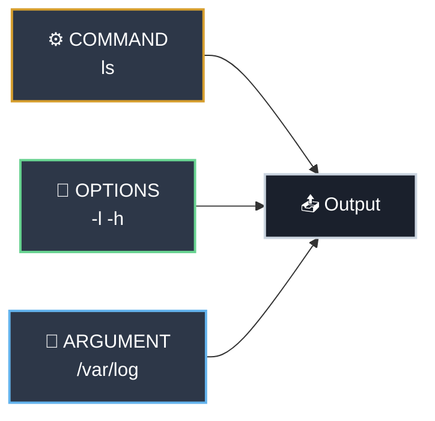

# Command Line Fundamentals

!!! tip "Part of Essentials"
    This is the first article in the Essentials series — the foundation every Linux professional must own cold. It assumes basic CLI familiarity (you've opened a terminal, run commands before, know what a path is).

If you've worked with Windows CMD or PowerShell, you already understand the concept: type a command, get output. What's different on Linux isn't the concept — it's that the shell is far more capable, and the productivity gap between someone who knows the shell's built-in tools and someone who doesn't is enormous.

This article closes that gap. The engineers who navigate Linux efficiently aren't faster typists — they've internalized about a dozen keyboard shortcuts and patterns that the shell gives you for free.

---

## Anatomy of a Command

Before you can get fast, you need to understand what you're actually typing. Most Linux commands follow this structure:



``` bash title="Command Anatomy in Practice"
ls -lh /var/log
# ^  ^^ ^^^^^^^
# |  |  argument: the directory to list
# |  options: -l (long format) + -h (human-readable sizes)
# command: list directory contents
```

### Short Options vs Long Options

Most commands offer two forms for every option: a compact single-character form (prefixed with `-`) and a descriptive word form (prefixed with `--`). They do the same thing.

``` bash title="Short and Long Options Are Equivalent"
ls -l           # short form
ls --format=long  # long form (same result)

grep -r 'error' /var/log    # short form
grep --recursive 'error' /var/log  # long form (same result)
```

**Short options can be combined.** Long options cannot.

``` bash title="Combining Short Options"
ls -l -h -t         # works, but verbose
ls -lht             # same thing — combined short options
```

**When to use which:**

- **Short options** in commands you type interactively — faster
- **Long options** in scripts — self-documenting, much easier to read months later

### Arguments: What the Command Acts On

Arguments are the targets: files, directories, patterns, or other input. Some commands require them; most accept them.

``` bash title="Commands With and Without Arguments"
ls              # lists current directory (no argument = default)
ls /etc         # lists /etc (explicit argument)
ls /etc /var    # multiple arguments — lists both
```

!!! warning "Order Matters"
    Options typically come before arguments. Some commands are strict about this. When in doubt, follow the pattern `command [options] [arguments]`.

---

## Where You've Seen This

If you've used PowerShell, you already know tab completion. If you've used Docker CLI, kubectl, git, or the Python REPL, you've used tab completion there too — because it's built into the terminal and Bash, not the individual tools. Everything in this article applies across all of them.

The history shortcuts (`Ctrl+R`, `!!`, `!$`) are Linux/macOS-specific patterns, but the concept — not retyping commands you've already run — is universal. PowerShell has `PSReadLine` for the same purpose. What Linux engineers have is a richer, keyboard-driven version that's been stable for decades.

Command chaining (`&&`, `||`, `;`) maps directly to what you'd write in a batch file or PowerShell script with `-and`, `-or`, and sequencing. The Linux version is more concise and more composable.

---

## The Shell's Productivity Superpowers

This is where the real gap between beginners and professionals lives. These features are built into Bash and work on any Linux system — no installation required.

<div class="grid cards" markdown>

-   :material-tab: **Tab Completion**

    ---

    **Why it matters:** Tab completion is the single biggest speed multiplier at the command line. It prevents typos, completes paths you can't remember, and shows you available options.

    ``` bash title="Tab Completion in Action"
    ls /var/log/ng<TAB>
    # expands to: ls /var/log/nginx/

    systemctl restart post<TAB>
    # expands to: systemctl restart postgresql
    ```

    **Key insight:** If nothing happens when you press Tab, it means there's more than one match. Press Tab **twice** to see all completions.

    ``` bash title="Double Tab: See All Options"
    ls /etc/sys<TAB><TAB>
    # sysconfiguration/   sysctl.conf    sysctl.d/
    # → now you can type more to narrow it down
    ```

-   :material-history: **History Search (Ctrl+R)**

    ---

    **Why it matters:** Every engineer runs long, complex commands. `Ctrl+R` lets you find any command you've run before in seconds — without scrolling through history line by line.

    ``` bash title="Reverse History Search"
    # Press Ctrl+R, then start typing
    (reverse-i-search)`docker': docker compose up -d --build
    # Press Ctrl+R again to cycle through older matches
    # Press Enter to run, or Right arrow to edit first
    ```

    **Key insight:** Type just a few unique characters from the command you're looking for. `k8s`, `prod`, `deploy` — whatever's distinctive.

-   :material-lightning-bolt: **History Expansion**

    ---

    **Why it matters:** Often you want to re-run the last command slightly modified, or pass the last argument to a new command. History expansion does this in 2-3 keystrokes.

    ``` bash title="History Expansion Shortcuts"
    # !! — repeat the entire last command
    cat /etc/nginx/nginx.conf
    sudo !!
    # → sudo cat /etc/nginx/nginx.conf

    # !$ — last argument of the previous command
    mkdir /opt/myapp/config
    cd !$
    # → cd /opt/myapp/config

    # !^ — first argument of the previous command
    diff /etc/hosts /etc/hosts.bak
    cp !^
    # → cp /etc/hosts
    ```

    **Key insight:** `sudo !!` is one of the most useful patterns in Linux — you run a command, realize you needed `sudo`, and just prepend it.

-   :material-keyboard: **Cursor Shortcuts**

    ---

    **Why it matters:** You've typed a long command and need to fix something in the middle. These shortcuts let you navigate and edit without reaching for the mouse.

    ``` bash title="Cursor Shortcuts"
    # Navigation
    Ctrl+A    # jump to beginning of line
    Ctrl+E    # jump to end of line
    Alt+B     # jump back one word
    Alt+F     # jump forward one word

    # Editing
    Ctrl+W    # delete word before cursor
    Ctrl+K    # delete from cursor to end of line
    Ctrl+U    # delete entire line
    Ctrl+L    # clear the screen (same as 'clear')
    ```

    **Key insight:** `Ctrl+W` is especially useful — it deletes the last word, letting you fix a path or argument without retyping the whole command.

</div>

---

## Navigating History Without Ctrl+R

History search covers most cases, but knowing the other ways to work with history rounds out your toolkit.

``` bash title="History Navigation"
# Arrow keys — scroll through history one command at a time
↑    # previous command
↓    # next command

# The 'history' command — view your command history
history
# 1001  ls -lh /var/log
# 1002  cat /etc/nginx/nginx.conf
# 1003  sudo systemctl restart nginx
# 1004  history

# Run a specific command from history by number
!1003
# → sudo systemctl restart nginx

# Search history with grep
history | grep docker
# 987  docker ps
# 991  docker logs myapp
# 995  docker compose up -d
```

??? tip "Persist History Across Sessions"
    By default, Bash only keeps a limited history and loses it between terminal sessions. Add these to your `~/.bashrc` to fix that:

    ``` bash title="Better History Settings (~/.bashrc)"
    export HISTSIZE=10000        # keep 10,000 commands in memory
    export HISTFILESIZE=20000    # keep 20,000 commands on disk
    export HISTCONTROL=ignoredups:erasedups  # no duplicate entries
    shopt -s histappend         # append instead of overwriting
    ```

    After editing, run `source ~/.bashrc` to apply.

---

## Command Chaining

Running commands one at a time is fine. Chaining them together is what you'll see in every real-world script and shell session.

### Exit Codes: The Glue of Chaining

Every command exits with a numeric status code. `0` means success. Anything else means failure.

``` bash title="Checking Exit Codes"
ls /etc/nginx
echo $?
# 0   → success, directory exists

ls /etc/doesnotexist
echo $?
# 2   → failure, directory not found
```

You don't usually check `$?` directly in interactive sessions — but it's what the chaining operators use behind the scenes.

### The Three Chaining Operators

=== "; — Always Run Both"

    **Runs the second command regardless of whether the first succeeded.**

    ``` bash title="Semicolon: Sequential Execution"
    apt update ; apt upgrade
    # runs apt upgrade even if apt update fails
    ```

    Use when the second command doesn't depend on the first.

=== "&& — Run Only on Success"

    **Runs the second command only if the first succeeded (exit code 0).**

    ``` bash title="AND: Conditional Execution"
    mkdir /opt/myapp && cd /opt/myapp
    # only cd if mkdir succeeded
    # protects you from cd-ing to a directory that doesn't exist

    git pull && ./deploy.sh
    # only deploy if the pull succeeded
    ```

    This is the pattern you'll see most in production scripts. It's defensive — if something fails early, the rest doesn't run.

=== "|| — Run Only on Failure"

    **Runs the second command only if the first failed.**

    ``` bash title="OR: Fallback Execution"
    command_that_might_fail || echo "Something went wrong"
    # prints the message only if the command failed

    grep -q 'nginx' /etc/hosts || echo "nginx not found in hosts"
    ```

    Use for fallbacks, error messages, or default behavior.

### Combining Chains

These operators compose naturally:

``` bash title="Combining Chains in Practice"
# Create a directory, move into it, and initialize a git repo
# — stops if any step fails
mkdir /opt/myproject && cd /opt/myproject && git init

# Back up a config file, then edit it safely
cp /etc/nginx/nginx.conf /etc/nginx/nginx.conf.bak && vim /etc/nginx/nginx.conf
```

!!! tip "Chain or Script?"
    If you find yourself writing the same chain more than twice, turn it into a shell script. But start with chains — they're fast to prototype and easy to reason about.

---

## Common Scenarios

=== "I Can't Remember the Full Path"

    **Use tab completion to explore.**

    You know the file is somewhere in `/var/log` but you can't remember the exact path.

    ``` bash title="Exploring With Tab"
    ls /var/log/<TAB><TAB>
    # Shows everything in /var/log/

    ls /var/log/nginx/<TAB><TAB>
    # access.log   error.log

    tail -f /var/log/nginx/access.log
    ```

    **Pattern:** Tab twice to see options, type a few characters to narrow down, Tab to complete.

=== "I Ran This Command Before"

    **Use Ctrl+R to find it.**

    You ran a complex `find` command last week and want to run it again.

    ``` bash title="Finding Previous Commands"
    # Press Ctrl+R
    (reverse-i-search)`find': find /var/log -name "*.log" -mtime -7 -size +10M
    # Press Enter to run immediately
    # Press Right arrow to edit before running
    ```

    **Pattern:** Press `Ctrl+R`, type something distinctive from the command (like the directory or a flag), hit Enter.

=== "Permission Denied — Need Sudo"

    **Use !! to avoid retyping.**

    ``` bash title="Adding Sudo Without Retyping"
    cat /etc/sudoers
    # cat: /etc/sudoers: Permission denied

    sudo !!
    # → sudo cat /etc/sudoers
    ```

    **Pattern:** `sudo !!` is muscle memory for experienced engineers.

=== "Long Command With a Typo"

    **Use cursor shortcuts to fix it without retyping.**

    You typed a long command but the path at the beginning is wrong.

    ``` bash title="Fixing a Typo Mid-Command"
    # You typed:
    tail -f /var/lgo/nginx/access.log
    #              ^^^
    # Ctrl+A moves to the start of the line
    # Alt+F skips forward word by word
    # Ctrl+W deletes /var/lgo/ and you retype /var/log/
    ```

    **Pattern:** `Ctrl+A` to jump to start, `Alt+F` to hop over words, `Ctrl+W` to delete and retype the bad part.

---

## Quick Reference

### Keyboard Shortcuts

| Shortcut | What It Does |
|----------|-------------|
| `Tab` | Complete command, path, or filename |
| `Tab Tab` | Show all possible completions |
| `↑` / `↓` | Scroll through history |
| `Ctrl+R` | Reverse search through history |
| `Ctrl+A` | Jump to beginning of line |
| `Ctrl+E` | Jump to end of line |
| `Alt+B` | Jump back one word |
| `Alt+F` | Jump forward one word |
| `Ctrl+W` | Delete word before cursor |
| `Ctrl+K` | Delete from cursor to end of line |
| `Ctrl+U` | Delete entire line |
| `Ctrl+L` | Clear the screen |
| `Ctrl+C` | Cancel current command |
| `Ctrl+D` | Exit the shell (or send EOF) |

### History Expansion

| Shortcut | What It Does |
|----------|-------------|
| `!!` | Entire last command |
| `!$` | Last argument of previous command |
| `!^` | First argument of previous command |
| `!1003` | Run command #1003 from history |
| `history \| grep X` | Search history for X |

### Chaining Operators

| Operator | Behavior |
|----------|----------|
| `;` | Run second command regardless |
| `&&` | Run second command only if first succeeded |
| `\|\|` | Run second command only if first failed |

---

## Practice Exercises

??? question "Exercise 1: Tab Completion Practice"
    Without using your arrow keys or retyping, navigate to `/var/log/` and list the contents using only Tab completion.

    Then try: complete `systemctl stat<TAB>` — what does it expand to?

    ??? tip "Solution"
        ``` bash title="Tab Completion Navigation"
        cd /var/log/   # type 'cd /var/l' then Tab to complete

        ls             # list what's here

        systemctl stat<TAB>
        # → systemctl status
        ```

        If Tab didn't complete `systemctl stat`, press Tab twice to see if there are multiple completions.

??? question "Exercise 2: History Recall"
    Run this command:

    ``` bash title="Run First"
    ls -lh /var/log/
    ```

    Now, without retyping it, use `Ctrl+R` to find and run it again. Then use `!$` to `cd` into the same directory.

    ??? tip "Solution"
        ``` bash title="History Recall"
        # Press Ctrl+R, type 'var/log' — you'll see the ls command
        # Press Enter to run it

        cd !$
        # !$ = last argument of previous command = /var/log/
        # → cd /var/log/
        ```

??? question "Exercise 3: Chaining Practice"
    Write a single chained command that:

    1. Creates a directory `/tmp/testproject`
    2. Only if that succeeded, creates a file inside it called `README.md`
    3. Only if that succeeded, prints "Setup complete"

    ??? tip "Solution"
        ``` bash title="Chained Setup Command"
        mkdir /tmp/testproject && touch /tmp/testproject/README.md && echo "Setup complete"
        ```

        The `&&` operator ensures each step only runs if the previous one succeeded. If `mkdir` fails (directory already exists), neither `touch` nor `echo` will run.

??? question "Exercise 4: The sudo !! Pattern"
    Run the following command and get a permission denied error:

    ``` bash title="This Will Fail"
    cat /etc/sudoers
    ```

    Then, without retyping the command, run it with `sudo`.

    ??? tip "Solution"
        ``` bash title="sudo !! Pattern"
        cat /etc/sudoers
        # cat: /etc/sudoers: Permission denied

        sudo !!
        # → sudo cat /etc/sudoers
        ```

        `!!` is replaced by the shell with the entire previous command before execution.

---

## Quick Recap

The command line fundamentals every Linux professional owns cold:

- **Command anatomy:** `COMMAND [OPTIONS] [ARGUMENTS]` — short options combine (`-lht`), long options self-document (`--human-readable`)
- **Tab completion:** your #1 speed tool — one Tab to complete, two Tabs to see all options
- **Ctrl+R:** find any previous command by typing a few characters
- **History expansion:** `sudo !!` (repeat last command), `cd !$` (last argument), `!1003` (by number)
- **Cursor shortcuts:** `Ctrl+A/E` to navigate, `Ctrl+W` to delete a word, `Ctrl+L` to clear
- **Chaining:** `;` (always), `&&` (on success), `||` (on failure) — the backbone of shell automation

---

## Further Reading

### Command References

- `man bash` — the complete Bash reference manual (long, but comprehensive)
- `man history` — the history command in detail
- `bash --version` — which version of Bash you're running

### Deep Dives

- [Bash Guide for Beginners](https://tldp.org/LDP/Bash-Beginners-Guide/html/) — The Linux Documentation Project's thorough Bash guide
- [The Art of Command Line](https://github.com/jlevy/the-art-of-command-line) — battle-tested command line tips from experienced engineers
- [Bash Hackers Wiki](https://wiki.bash-hackers.org/) — detailed reference for shell scripting and interactive Bash

### Official Documentation

- [GNU Bash Manual](https://www.gnu.org/software/bash/manual/) — the authoritative Bash reference
- [Red Hat Bash Reference](https://access.redhat.com/documentation/en-us/red_hat_enterprise_linux/9/html/configuring_basic_system_settings/assembly_using-bash_configuring-basic-system-settings) — RHEL-specific shell configuration guide

---

## What's Next?

You've got the fundamentals. Now you need to actually navigate the Linux filesystem — and that means understanding where everything lives.

Head to **[Filesystem Hierarchy](filesystem_hierarchy.md)** to learn the structure every Linux system shares, why `/etc` is for configuration, why `/var` is for variable data, and where to look for logs, binaries, and application files.

Once you understand the layout, **[Finding Files](finding_files.md)** will show you how to locate anything on a system quickly — whether it's a config file, a log, or a binary you're not sure where was installed.
