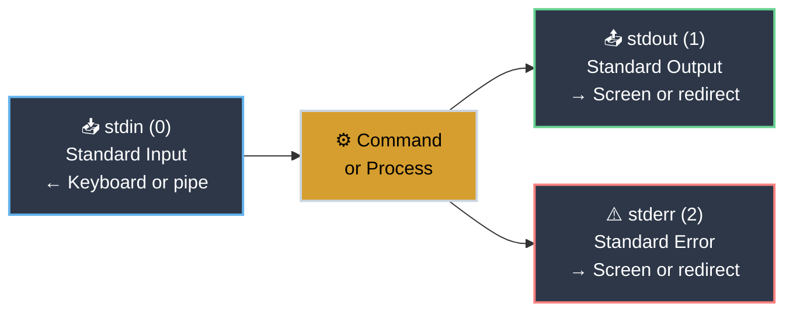

# Pipes and Redirection

<!-- PATHWAY_ROADMAP:START -->
<div class="pathway-pills" markdown>
:material-map-marker-path: <span class="pathway-pills__label">Part of a deep dive and a pathway:</span> [Text & Pipelines](pipes_and_redirection.md){: .pathway-pill } [Debugging With Nothing But a Terminal](https://bradpenney.io/pathways/nothing-but-a-terminal){: .pathway-pill }
</div>

??? abstract ":material-map-legend: Consult the map"

    <div class="grid cards two-col" markdown>

    -   :material-pipe: __Text & Pipelines__ — step 1 of 2

        ---

        ← *(first step)* · **you are here** · [grep](grep.md) →

        [Start the deep dive →](pipes_and_redirection.md)

    -   :material-console: __Debugging With Nothing But a Terminal__ — step 3 of 20

        ---

        ← [Terminal Diagnostics](https://tools.bradpenney.io/essentials/terminal_diagnostics/) · **you are here** · [`grep`](https://linux.bradpenney.io/essentials/grep/) →

        [Start the pathway →](https://bradpenney.io/pathways/nothing-but-a-terminal)

    </div>
<!-- PATHWAY_ROADMAP:END -->

!!! tip "Prerequisites"
    This article assumes you're comfortable with basic commands and [command chaining](command_line_fundamentals.md#command-chaining) (`&&`, `||`). Pipes are related but different — they connect command *output* to command *input*, not just sequence execution.

The most powerful Linux one-liners you'll ever see don't use a single complex command. They use simple commands connected together. `cat access.log | grep "500" | awk '{print $1}' | sort | uniq -c | sort -nr | head -10` — that's ten minutes of investigation distilled to one line, and each part is a simple tool you already know.

That's the Unix philosophy in action: programs that do one thing well, connected by pipes. This article shows you how to connect them.

---

## Where You Might Have Seen This

If you've used PowerShell, you know pipes — `Get-Process | Where-Object CPU -gt 10 | Sort-Object CPU -Descending`. The Linux version works the same way conceptually, but passes plain text instead of objects. That difference matters: Linux pipelines are more composable (any tool can talk to any other tool), but you work with structured text rather than typed objects.

If you've built ETL pipelines, data workflows, or streaming architectures — Kafka, Spark, Logstash — the stdin/stdout model is the same idea at shell scale. Data flows from source through transformations to sink. Each command is a transform.

Redirection (`>`, `>>`, `2>`) is the command-line equivalent of writing to a file in any language. You've done this before; the Linux operators are just a more concise syntax.

---

## Standard Streams: The Foundation

Every process in Linux has three data channels open by default:



| Stream | Number | Default | What Goes Here |
|--------|--------|---------|----------------|
| **stdin** | 0 | Keyboard | Input to commands |
| **stdout** | 1 | Terminal | Normal output |
| **stderr** | 2 | Terminal | Error messages |

By default, stdout and stderr both print to your terminal mixed together. Redirection and pipes give you control over each stream separately.

---

## Redirection: To and From Files

Redirection changes where a stream goes — from the terminal to a file, or from a file to a command's input.

<div class="grid cards" markdown>

-   :material-arrow-right: **Output Redirection (>)**

    ---

    **Why it matters:** Capture command output to a file for logging, later processing, or sharing with others.

    ``` bash title="Redirect stdout to a File"
    ls -lh /var/log/ > filelist.txt   # (1)!
    df -h > disk-report.txt
    ```

    1. Create or overwrite the file.

    !!! warning "> Overwrites Without Warning"
        `>` will silently overwrite an existing file. There's no confirmation. If `report.txt` existed, it's gone.

        To protect against this in interactive sessions:
        ``` bash title="Prevent Overwrite with noclobber"
        set -o noclobber    # (1)!
        ls > existing.txt   # (2)!
        ls >| existing.txt  # (3)!
        ```

        1. Add this to `~/.bashrc`.
        2. Now fails with "cannot overwrite existing file".
        3. Force the overwrite when noclobber is set.

-   :material-arrow-right-box: **Append Redirection (>>)**

    ---

    **Why it matters:** Add to an existing file without overwriting it. The essential operator for log files and accumulating data.

    ``` bash title="Append to a File"
    echo "Deployment started at $(date)" >> deploy.log
    df -h >> disk-history.txt   # (1)!

    echo "=== $(date) ===" >> report.txt   # (2)!
    uptime >> report.txt
    free -h >> report.txt
    df -h >> report.txt
    ```

    1. Build a history over time.
    2. Run multiple commands and collect all their output into one report.

-   :material-arrow-left: **Input Redirection (<)**

    ---

    **Why it matters:** Feed a file into a command's stdin instead of typing. Less common in interactive use, but appears in scripts.

    ``` bash title="Redirect File to stdin"
    sort < names.txt                     # (1)!
    wc -l < access.log                   # (2)!
    mysql -u root -p mydb < schema.sql   # (3)!
    ```

    1. Sort the contents of `names.txt`.
    2. Count lines in `access.log`.
    3. Feed SQL to `mysql`.

-   :material-alert: **stderr Redirection (2>)**

    ---

    **Why it matters:** Error messages and normal output are separate streams. When you redirect with `>`, errors still print to the terminal. Use `2>` to capture them separately.

    ``` bash title="Redirect stderr"
    find / -name "hosts" 2>/dev/null      # (1)!
    find / -name "hosts" 2>errors.txt     # (2)!
    command > output.txt 2> errors.txt    # (3)!
    command > all.txt 2>&1                # (4)!
    ```

    1. Discard errors, keep results.
    2. Save errors to a file.
    3. Separate stdout and stderr into different files.
    4. `2>&1` redirects stderr (2) to wherever stdout (1) is currently going. Order matters: `> all.txt 2>&1` works; `2>&1 > all.txt` does not (the latter redirects stderr to the terminal, then redirects stdout to the file).

</div>

### Combining Redirections

Real scripts rarely use just one redirect operator — output, errors, and a live view on screen usually need to be handled together in the same command:

``` bash title="Multiple Redirections in Practice"
find /var/log -name "*.log" | tee found-logs.txt    # (1)!
./long-running-script.sh > results.txt 2>/dev/null  # (2)!
./deployment.sh > deploy.log 2>&1                    # (3)!
./script.sh > output.log 2> errors.log               # (4)!
```

1. Capture output to a file **and** show it on screen at once — `tee` reads stdin and writes to both stdout and a file.
2. Run a long job, save the output, discard errors.
3. Save both stdout and stderr to the same file.
4. Save stderr to one file, stdout to another.

### Here Documents and Here Strings

Provisioning scripts often need to drop a complete config file onto a server — an nginx vhost, a systemd unit, a database config — without shipping a separate template alongside the script. A chain of `echo "..." >> file` lines works but is painful to write and edit. A **here document** embeds the whole file inline instead, right in the script that generates it:

``` bash title="Here Documents"
cat << EOF > /etc/myapp/config.conf
[database]
host = db-prod-01
port = 5432
name = myapp_db
EOF

sudo tee /etc/nginx/sites-available/myapp << EOF
server {
    listen 80;
    server_name myapp.example.com;
    root /var/www/myapp;
}
EOF
```

Everything between `<< EOF` and the matching `EOF` on its own line becomes the command's stdin. The first example writes a config file directly with `cat`; the second pipes the same trick through `sudo tee` — the standard way to write a file that needs elevated permissions from inside a script, since `sudo cat << EOF > file` doesn't work (the redirect runs as your user, not root).

For a single line instead of a whole file, `echo "text" | command` works but spins up an extra process just to hand off one string. A **here string** (`<<<`) skips that process — most useful for piping a variable's value straight into a command that only reads from stdin:

``` bash title="Here String (<<<)"
grep "pattern" <<< "string to search in"   # (1)!
base64 <<< "$TOKEN"                         # (2)!
```

1. Feed a single string straight to stdin — no file, no multi-line `EOF` block needed for one line.
2. The most common real use: feed a variable's value to a command that only reads from stdin, `base64` here, but the same trick works for anything.

---

## Pipes: Command to Command

A **pipe** (`|`) takes the stdout of the left command and feeds it as stdin to the right command. No intermediate file, no waiting — it's streaming.

``` bash title="Your First Pipeline"
ls -lh /var/log/ | less   # (1)!
```

1. `ls` produces the directory listing, the pipe (`|`) sends it to `less`, and `less` lets you scroll through it.

### Building Pipelines

Pipelines chain as many commands as you need:

``` bash title="Growing a Pipeline"
cat /var/log/nginx/access.log # (1)!
cat /var/log/nginx/access.log | grep " 500 " # (2)!
cat /var/log/nginx/access.log | grep " 500 " | awk '{print $1}' # (3)!
cat /var/log/nginx/access.log | grep " 500 " | awk '{print $1}' | sort # (4)!
cat /var/log/nginx/access.log | grep " 500 " | awk '{print $1}' | sort | uniq -c # (5)!
cat /var/log/nginx/access.log | grep " 500 " | awk '{print $1}' | sort | uniq -c | sort -nr # (6)!
cat /var/log/nginx/access.log | grep " 500 " | awk '{print $1}' | sort | uniq -c | sort -nr | head -10 # (7)!
```

1. Start simple — dump the whole access log.
2. Filter to 500 errors only.
3. Extract just the IP addresses.
4. Sort them.
5. Count occurrences of each IP.
6. Sort by count, most first.
7. Show only the top 10.


This is how investigation pipelines get built — one stage at a time, checking the output at each step.

### The Essential Pipeline Tools

These commands exist primarily to work within pipelines. Several of them look interchangeable at a glance — the table below is the fast way to pick the right one before the cards go into detail on each:

| You need to... | Reach for |
|:----------------|:----------|
| Keep only lines matching a pattern | `grep` |
| Discard lines matching a pattern | `grep -v` |
| Put lines in order | `sort` |
| Collapse duplicates, or count them | `sort \| uniq -c` |
| Pull out a column, simple fixed delimiter, no logic | `cut` |
| Pull out or transform a column with any real logic | `awk` |
| Find-and-replace text in a stream | `sed` |
| Count lines, words, or bytes | `wc` |
| Save to a file *and* keep piping | `tee` |
| See only the first or last N lines | `head` / `tail` |

=== ":material-filter: grep — Filter Lines"

    Filter a stream to only lines matching a pattern. Covered in depth in the [grep article](grep.md).

    ``` bash title="grep in Pipelines"
    journalctl | grep "Failed"
    ps aux | grep nginx
    cat /etc/passwd | grep -v "nologin"    # (1)!
    ```

    1. Exclude service accounts.

=== ":material-sort: sort — Sort Lines"

    Sort lines alphabetically or numerically.

    ``` bash title="sort in Pipelines"
    cat names.txt | sort              # (1)!
    du -sh /var/* | sort -hr          # (2)!
    cat numbers.txt | sort -n         # (3)!
    cat file.txt | sort -u            # (4)!
    ```

    1. Alphabetical.
    2. Human-readable sizes, largest first.
    3. Numeric sort.
    4. Sort and remove duplicates.

=== ":material-counter: uniq — Remove Duplicates / Count"

    Remove consecutive duplicate lines, or count their occurrences. Works best after `sort`.

    ``` bash title="uniq in Pipelines"
    cat file.txt | sort | uniq               # (1)!
    cat file.txt | sort | uniq -c            # (2)!
    cat file.txt | sort | uniq -d            # (3)!
    ```

    1. Unique lines only.
    2. Count occurrences.
    3. Only lines that appear more than once.

=== ":material-calculator: wc — Count"

    Count lines, words, or characters.

    ``` bash title="wc in Pipelines"
    ls /etc | wc -l                      # (1)!
    cat access.log | grep "404" | wc -l  # (2)!
    cat file.txt | wc -c                 # (3)!
    ```

    1. How many files in `/etc`?
    2. How many 404 errors?
    3. How many bytes?

The four tools above filter, sort, dedupe, and count. Five more round out the toolkit — for reshaping, rewriting, and duplicating a stream, rather than narrowing it down:

=== ":material-table: awk — Extract Fields"

    Extract specific columns from structured text, with the power to filter, compute, or reformat as it goes. Reach for `awk` over `cut` the moment you need more than plain column selection.

    ``` bash title="awk in Pipelines"
    ps aux | awk '{print $1, $2}'                # (1)!
    df -h | awk '{print $1, $5}'                 # (2)!
    cat /etc/passwd | awk -F: '{print $1, $3}'   # (3)!
    ```

    1. Print the user and PID columns.
    2. Filesystem and usage %.
    3. Username and UID.

=== ":material-find-replace: sed — Find and Replace"

    Rewrite text in a stream: substitute, delete, or print specific lines, without opening a file in an editor.

    ``` bash title="sed in Pipelines"
    cat nginx.conf | sed 's/8080/9090/'   # (1)!
    journalctl | sed -n '10,20p'          # (2)!
    cat access.log | sed '/^#/d'          # (3)!
    ```

    1. Replace the first `8080` with `9090` on each line.
    2. Print only lines 10 through 20 — `-n` suppresses default output, `p` prints the match.
    3. Delete lines starting with `#` (comments).

=== ":material-scissors-cutting: cut — Extract Columns"

    Extract specific columns or character positions from fixed-format output — simpler and faster than `awk` when the delimiter is consistent and you don't need any logic beyond selection.

    ``` bash title="cut in Pipelines"
    cat /etc/passwd | cut -d: -f1     # (1)!
    cat /etc/passwd | cut -d: -f1,3   # (2)!
    ls -l | cut -c1-10                # (3)!
    ```

    1. Extract the first field (username).
    2. Username and UID.
    3. First 10 characters of each line.

=== ":material-magnify: tee — Split Output"

    Write to a file AND pass through to the next pipe. Essential when you want to save intermediate results.

    ``` bash title="tee in Pipelines"
    find /var/log -name "*.log" | tee found-logs.txt | wc -l   # (1)!
    command | tee output.txt | grep "ERROR"                    # (2)!
    ```

    1. Saves the file list AND prints the count.
    2. Saves everything to `output.txt`, passes only errors downstream.

=== ":material-arrow-up-down: head / tail — Limit Output"

    Take only the first or last N lines. Ubiquitous at the end of pipelines.

    ``` bash title="head and tail in Pipelines"
    ps aux | sort -k3 -nr | head -5      # (1)!
    ls -lt /var/log/ | head -10          # (2)!
    cat access.log | tail -100           # (3)!
    ```

    1. Top 5 CPU consumers.
    2. 10 most recently modified logs.
    3. Last 100 lines.

!!! tip "awk and sed Are Their Own Languages"
    Everything shown for `awk` and `sed` above is the pipeline-scale slice — one-liners that solve one problem inline. Both are actually complete, standalone scripting languages: `awk` has variables, functions, and control flow built around a "pattern → action" model, and `sed` has its own addressing and command syntax for editing files in scripts (`-i` for in-place edits, branching, hold space). Whole books exist on each — *sed & awk* (Dougherty & Robbins) and *The AWK Programming Language* (Aho, Kernighan, Weinberger) — because both go far deeper than "extract a column" or "swap a string." Reach for that depth once a one-liner stops being enough.

### stderr in Pipelines

A critical detail: **pipes only carry stdout**. stderr bypasses the pipe and goes directly to the terminal.

``` bash title="Stderr Bypasses Pipes"
find / -name "*.conf" | wc -l   # (1)!
```

1. Errors print to the screen; only successful results go to `wc`.

To include stderr in a pipeline:

``` bash title="Including stderr in Pipelines"
find / -name "*.conf" 2>&1 | wc -l          # (1)!
find / -name "*.conf" 2>/dev/null | wc -l   # (2)!
```

1. Count everything, including error lines.
2. Suppress errors, count only results.

---

## Real-World Pipeline Patterns

Individually, each tool above does one small thing. Chained together during a real incident, they answer specific questions fast — four of the most common ones:

=== "Log Analysis"

    Find the most common errors in the past hour:

    ``` bash title="Log Analysis Pipeline"
    grep " 404 " /var/log/nginx/access.log \
      | awk '{print $1}' \
      | sort | uniq -c \
      | sort -nr \
      | head -10                              # (1)!

    journalctl --since "24 hours ago" --until now \
      | grep -i "error" \
      | awk '{print $1, $2, substr($3,1,2)}' \
      | sort | uniq -c                        # (2)!
    ```

    1. What IP addresses are causing the most 404s?
    2. How many errors per hour in the last day?

=== "Process Investigation"

    Find what's consuming resources:

    ``` bash title="Process Investigation Pipeline"
    ps aux --sort=-%mem | head -6   # (1)!

    ps aux | grep "^www-data"       # (2)!

    ss -tlnp | grep ":8080"         # (3)!

    ss -s | grep "TCP:"             # (4)!
    ```

    1. Top 5 memory consumers (human-readable).
    2. All processes owned by `www-data`.
    3. Find processes listening on a port.
    4. How many connections per state?

=== "Disk Space Investigation"

    Find what's eating disk:

    ``` bash title="Disk Analysis Pipeline"
    du -sh /var/* 2>/dev/null | sort -hr | head -10   # (1)!

    find / -type f -size +100M 2>/dev/null \
      | xargs ls -lh 2>/dev/null \
      | sort -k5 -hr \
      | head -10                                      # (2)!

    find /var/log -name "*.log" -newer /var/log -type f \
      | xargs ls -lh 2>/dev/null \
      | sort -k5 -hr                                   # (3)!
    ```

    1. Largest directories in `/var`.
    2. Largest files anywhere on the system.
    3. Which log files grew today?

=== "Config File Work"

    Process configuration files:

    ``` bash title="Config Processing Pipeline"
    grep -v "^#" /etc/ssh/sshd_config | grep -v "^$"   # (1)!

    grep -v "^#" /etc/ssh/sshd_config \
      | grep -v "^$" \
      | awk '{print $1}' \
      | sort -u                                         # (2)!

    grep -v "^#" /etc/ssh/sshd_config | grep "PermitRootLogin"   # (3)!
    ```

    1. Find all uncommented settings in a config file.
    2. Find all unique setting names.
    3. Check if a setting is enabled.

---

## Quick Reference

### Redirection Operators

| Operator | What It Does | Example |
|----------|-------------|---------|
| `>` | Redirect stdout to file (overwrite) | `ls > files.txt` |
| `>>` | Redirect stdout to file (append) | `echo "line" >> log.txt` |
| `<` | Redirect file to stdin | `sort < names.txt` |
| `2>` | Redirect stderr to file | `find / 2>/dev/null` |
| `2>&1` | Redirect stderr to stdout | `command > all.txt 2>&1` |
| `&>` | Redirect both stdout and stderr | `command &> all.txt` |
| `\|` | Pipe stdout to next command | `ls \| grep ".conf"` |
| `\| tee` | Write to file and pass through | `cmd \| tee file.txt \| wc -l` |

### Pipeline Toolkit

| Command | What It Does in Pipelines |
|---------|--------------------------|
| `grep pattern` | Keep only lines matching pattern |
| `grep -v pattern` | Remove lines matching pattern |
| `sort` | Sort lines alphabetically |
| `sort -n` | Sort numerically |
| `sort -hr` | Sort human-readable sizes, largest first |
| `uniq` | Remove consecutive duplicates |
| `uniq -c` | Count occurrences |
| `wc -l` | Count lines |
| `head -N` | Keep first N lines |
| `tail -N` | Keep last N lines |
| `awk '{print $N}'` | Extract Nth field |
| `sed 's/x/y/'` | Find and replace text |
| `cut -d: -f1` | Extract field by delimiter |
| `tee file.txt` | Write to file and pass through |

---

## Practice Exercises

??? question "Exercise 1: Build a Log Analysis Pipeline"
    Using `/var/log/auth.log` (or `/var/log/secure` on RHEL), build a pipeline that:

    1. Shows only lines containing "Failed"
    2. Extracts the source IP address (the IP after "from" in the line)
    3. Counts how many failed attempts per IP
    4. Sorts by count, highest first
    5. Shows the top 5 offenders

    ??? tip "Solution"
        ``` bash title="Log Analysis Pipeline"
        grep "Failed" /var/log/auth.log \
          | awk '/from/{print $(NF-3)}' \
          | sort \
          | uniq -c \
          | sort -nr \
          | head -5
        ```

        The `awk` pattern prints the field 3 from the end (`NF-3`) — on typical auth.log "Failed password" lines, this is the IP address.

??? question "Exercise 2: Redirect and Tee"
    Run a disk space analysis (`du -sh /var/* 2>/dev/null`) that:

    1. Saves the complete output to `/tmp/disk-report.txt`
    2. Simultaneously shows only entries larger than 1GB on the terminal

    ??? tip "Solution"
        ``` bash title="tee with Filtering"
        du -sh /var/* 2>/dev/null | tee /tmp/disk-report.txt | grep "^[0-9]*G"
        ```

        `tee` saves everything to the file; the pipe after `tee` sends the same data to `grep`, which filters for lines starting with a size in gigabytes.

??? question "Exercise 3: Separate stdout and stderr"
    Run `find / -name "sshd_config"` and:

    1. Save only the successful results (stdout) to `/tmp/found.txt`
    2. Discard all "Permission denied" errors (stderr)
    3. Print the count of found files to the terminal

    ??? tip "Solution"
        ``` bash title="Separate Streams"
        find / -name "sshd_config" 2>/dev/null > /tmp/found.txt
        wc -l < /tmp/found.txt

        find / -name "sshd_config" 2>/dev/null | tee /tmp/found.txt | wc -l   # (1)!
        ```

        1. Or do it in one pipeline — `tee` saves the results while `wc -l` counts them.

That ten-minute investigation from the opening — `cat | grep | awk | sort | uniq -c | sort -nr | head` — is nothing more than the two ideas in this article, chained: redirection controls where a stream starts or ends, and pipes control what happens to it in between. Once both are second nature, you stop looking up pipeline recipes and start building the one you need on the spot.

---

## Quick Recap

- **Three streams:** stdin (0), stdout (1), stderr (2) — redirect each independently
- **`>`** overwrites; **`>>`** appends — the most common mistake is using `>` when you meant `>>`
- **`2>/dev/null`** — silence errors; ubiquitous in `find` and other commands that hit permission-denied directories
- **`2>&1`** — merge stderr into stdout; essential when capturing all output to a file
- **`|`** pipes only stdout — to include stderr, add `2>&1` before the pipe
- **Build pipelines incrementally** — add one stage at a time, verify output, then extend
- **Core toolkit:** `grep`, `sort`, `uniq -c`, `wc -l`, `head`, `tail`, `awk`, `sed`, `cut`, `tee`

## What's Next?

Pipes flow data between commands, and the most common thing you'll do with that data is search it. `grep` is the workhorse of Linux text processing — and it deserves its own deep dive.

Head to **[grep](grep.md)** to learn regular expressions, recursive searching, context flags, and the patterns that turn `grep` from a simple filter into a powerful investigation tool.

If you're following the [Debugging With Nothing But a Terminal](https://bradpenney.io/pathways/nothing-but-a-terminal) pathway, that's the same next step.

---

## Further Reading

### Command References

- `man bash` — the "Redirection" section covers every redirect operator
- `man tee` — the tee command in detail
- `man awk` — the full awk reference (also `man gawk` for GNU awk)
- `man sort` — sort options including locale-aware and stable sorting
- `man uniq` — uniq options

### Deep Dives

- [The Art of Command Line: Data Wrangling](https://github.com/jlevy/the-art-of-command-line#data-wrangling) — practical pipeline patterns
- [Bash Redirections Cheat Sheet](https://wiki.bash-hackers.org/howto/redirection_tutorial) — Bash Hackers Wiki on redirection
- [Unix Philosophy](https://en.wikipedia.org/wiki/Unix_philosophy) — why pipes exist and why they work

### Official Documentation

- [GNU Coreutils Manual](https://www.gnu.org/software/coreutils/manual/) — sort, uniq, wc, tee, head, tail
- [GNU Bash Manual: Redirections](https://www.gnu.org/software/bash/manual/bash.html#Redirections) — complete redirect reference

