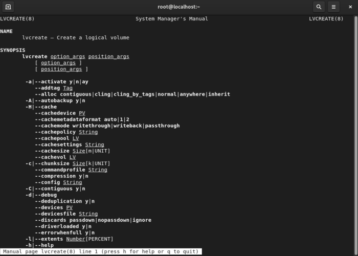

# Finding Help in Linux

Lost in the terminal? Don't worry — Linux has your back with tons of
built-in help. Whether you're just poking around or knee-deep in shell
scripts, there's always a way to get unstuck. Let's walk through some
handy ways to find help (and maybe a few hidden gems) right from your
command line.

## 1. Manual Pages (`man`)

The classic move: check the manual! Linux comes loaded with "man pages"
— detailed guides for almost every command and utility. To peek at the
manual for a command, just type:

```bash
man <command>
```

Curious about `lvcreate`? Try:

```bash
man lvcreate
```

Results in:


You'll get a full rundown: what the command does, all its options, and
some usage notes. It's like having a wise old wizard explain things (with
extra beard).

### Navigating the Manual Pages

- **Search:** Hit `/`, type your keyword, and press Enter to jump to what
  you need.
- **Quit:** Press `q` when you're done (no need to be polite).
- **Scroll:** Use the arrow keys or spacebar to move around.

### Rebuilding the Manual Pages

Just installed Linux and `man` seems a bit empty? Sometimes the manual
page database needs a refresh. You can rebuild it with:

```bash
mandb
```

This updates the index so you get the latest docs. Handy if you've just
added new packages or tools.

### Manual Page Sections (A Quick Map)

Man pages are split into sections — think of them as chapters in a
choose-your-own-adventure book:

- **1:** User commands (the stuff you'll run most often)
- **2:** System calls (how programs talk to the kernel)
- **3:** Library calls (functions in libraries)
- **4:** Special files (usually in `/dev`)
- **5:** File formats and conventions (like `/etc/passwd`)
- **6:** Games (yes, really)
- **7:** Miscellaneous (macros, conventions, and oddities)
- **8:** System admin commands (for the brave and root users)
- **9:** Kernel routines (advanced stuff)

If you're just starting out, sections 1 and 8 are your best friends.
Sections 5 and 7 are great for file formats and conventions.

But what if you don’t even know the command’s name yet? That’s where
searching comes in.

## 2. Fuzzy Searching For Commands

Can't remember the exact command? No problem — Linux lets you search by
keyword:

- **`man -k <keyword>`**: Lists all commands related to your keyword.
- **`apropos <keyword>`**: Does the same thing, just with a different
  name.

For example, to find anything about networking:

```bash
man -k network
```

Or:

```bash
apropos network
```

Want to narrow it down even more? Pipe it through `grep`:

```bash
man -k network | grep <subkeyword>
```

It's like asking Linux, "Hey, what do you know about this?" — and getting
a list of everything it can find.

Once you’ve found the right command, though, you don’t always need the
full manual. Sometimes you just want a quick hint — enter `--help`.

## 3. Quick Hints with the `--help` Option

Almost every Linux command has a built-in help option you can summon with
`--help`. Think of it as the command whispering, “Here’s what I can do” —
without dragging you through the whole manual.

Try this with `ls`:

```bash
ls --help
```

You’ll get a concise list of options, their meanings, and sometimes even a
few examples. It’s perfect when you just need a quick refresher.

A couple of tips:

- **Single vs double dash:** Some older commands use `-h` instead of
`--help`. If `--help` doesn’t work, try `-h`.

- **Too much text?** Pipe it into `less` to make it scrollable:

    ```bash
    ls --help | less
    ```

- **Not universal:** A few grumpy old commands (looking at you, `vi`)
  don’t play by these rules — in those cases, man is still your friend.

This is usually the fastest way to jog your memory on a command’s
options. For deeper dives or background details, head back to the `man`
pages.

---

With these tricks — **man pages** for the deep dives, **fuzzy searching**
when you can’t quite remember the name, and the handy `--help` flag for a
quick refresher — you’ll never be stuck for long.

The Linux help system is deep, but friendly once you know where to look.
Keep exploring, keep asking questions, and remember: even the pros check
the manual (sometimes twice).