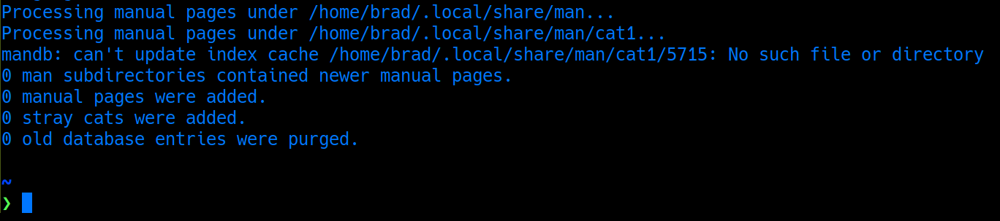

# Generating the Manual

A listing of the pages in the Manual is stored in a system-generated
database. Accessing them is as simple as running `man <command>`, and
you'll usually get a detailed listing of how to use that command. Check
out [Finding Help in Linux](finding_help.md) for more
info about using `man`.

### Help! The Manual is Missing!

On a freshly created Linux system, it's common for the Manual Pages to
not be generated yet. Running `man <command>` might give you an error,
even for basic utilities like `ls`. That's a pain — especially since
new systems often mean running lots of commands with rarely-used
options. Sometimes, the Manual can also get outdated after a software
update and need a rebuild.

Most Linux distributions use a scheduled job to generate the Manual,
usually once a day. But if you need it right now, you can update the
Manual yourself in a flash. Just run:

```bash
mandb
```



Once that's done, your Manual will be fully stocked and ready for
exploration. Happy learning!
