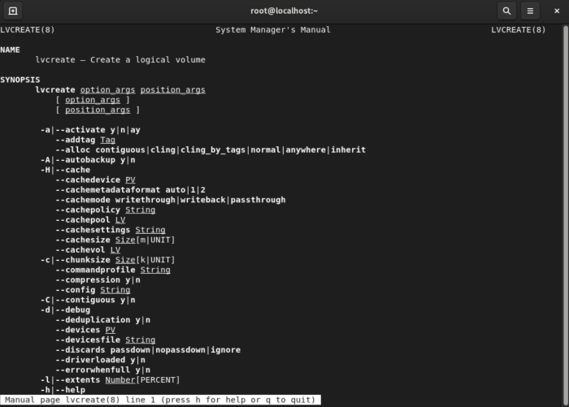

# How to Get Unstuck: A Guide to Finding Help on the Command Line

Let's be honest: the command line can feel like a foreign country. You're trying to have a conversation, but you don't know the vocabulary. You know *what* you want to do, but you can't remember the exact word.

Getting stuck isn't a sign of failure; it's a normal part of learning any new language. The good news is that Linux provides a built-in dictionary, thesaurus, and encyclopedia. You just need to know how to ask for help.

I think of it as three levels of asking for help, from a gentle nudge to a deep dive.

## Level 1: The Quick Reminder (`--help`)
**Best for:** "I know the command, but what was that specific option again?"

This is your short-term memory jog. Almost every command has a `--help` flag that gives you a "cheat sheet" of its options and basic usage. It's fast, friendly, and right there in your terminal.

```bash
ls --help
```

This is my go-to 90% of the time. I know I want to use `ls`, but I can't remember if the option for sorting by size is `-S` or `-s`. A quick `ls --help | less` gives me the answer without breaking my flow.

A couple of tips:
- Some older commands use a single-dash `-h`. If `--help` doesn't work, give that a try.
- The output can be long. Pipe it to `less` to make it scrollable: `command --help | less`.

## Level 2: The User Manual (`man`)
**Best for:** "I need to understand what this command *really* does."

If `--help` is a cheat sheet, `man` (short for manual) is the full textbook. These are the official user manuals for nearly every command on your system, written by the engineers who built them. They are dense, detailed, and invaluable.

```bash
man ls
```

This will open up a pager (usually `less`) with the complete documentation for `ls`.


*(This image shows `man lvcreate`, but the idea is the same!)*

At first, man pages can feel intimidating. Here's how to navigate them:
- **Scroll:** Use the arrow keys, Page Up/Down, or the spacebar.
- **Search:** Type `/` followed by a keyword (e.g., `/sort`) and hit Enter. This will jump to the first match.
- **Quit:** Just press `q`.

### Deciphering the Man Page Sections
You'll sometimes see a command like `printf(1)` or `printf(3)`. That number is the man page "section," and it's a clue about what kind of command it is.

- **`man 1 command`**: General user commands. This is where you'll live most of the time. (`ls`, `cp`, `grep`).
- **`man 5 file`**: File formats and conventions. Wondering about the structure of `/etc/passwd`? Try `man 5 passwd`.
- **`man 8 command`**: System administration commands. These are tools that usually require `sudo`. (`fdisk`, `iptables`).

Don't worry about the other sections for now. Just knowing about 1, 5, and 8 will help you understand the context of what you're looking at.

## Level 3: The Library Index (`apropos`)
**Best for:** "I don't even know which command I need!"

What if you don't know the name of the command? You know you want to do something with "networking," but you have no idea where to start.

This is where `apropos` (or its twin, `man -k`) comes in. `apropos` searches the *descriptions* of all man pages for a keyword. It's like asking the librarian, "Show me all the books you have about networking."

```bash
apropos network
```

This will give you a list of every command on your system that has "network" in its name or description, along with a brief summary. From there, you can use `man` to read up on the most promising candidates. It’s an amazing discovery tool.

## Key Takeaways
| Level of Help | Command | When to Use It |
|:---|:---|:---|
| **1. Quick Reminder**| `--help` | You know the command, but forgot an option. |
| **2. User Manual** | `man` | You need a deep understanding of a command. |
| **3. Library Index** | `apropos`| You don't know the name of the command you need. |

---

## Practice Problems
Time to put your dictionary to use.

??? question "Challenge 1: The Quick Question"
    You're using the `cp` (copy) command. You want to copy a directory, and you remember there's an option for doing it "recursively," but you'm not sure which letter it is. How would you find out quickly?

    ??? tip "Answer"
        `cp --help`. You'd see the `-r` or `-R` or `--recursive` option and get your answer in seconds.

??? question "Challenge 2: The Deep Dive"
    You're learning about the `find` command, and it feels complicated. You want to read the official, detailed documentation for it. What's the command?

    ??? tip "Answer"
        `man find`. This will give you the full manual page with all the details.

??? question "Challenge 3: The Discovery"
    You want to find a command that deals with "users". You don't know any specific command names. How would you get a list of possibilities?

    ??? tip "Answer"
        `apropos user` or `man -k user`. This will search the man page descriptions and give you a great starting point.

---

I used to think that needing to look things up was a sign that I wasn't a "real" Linux user. That's nonsense. The pros don't memorize everything; they just get really, really good at finding the information they need, quickly.

So get comfortable with these tools. They're your safety net, your dictionary, and your guide. They're what turn the command line from a place of fear into a place of power.
